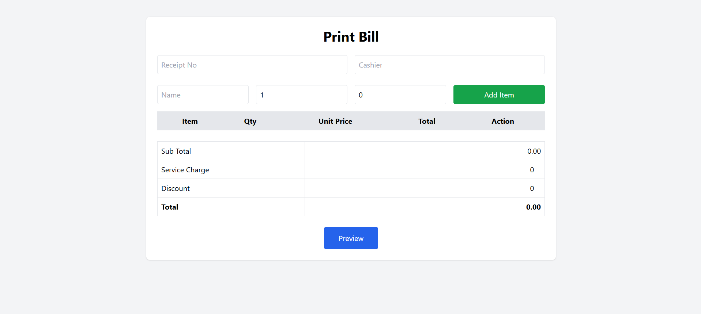

# ⭐ Ceylon Vistas POS ⭐

Welcome to the **Ceylon Vistas POS** — a modern and efficient restaurant management solution designed to simplify daily
operations. The system provides a seamless experience for billing, inventory management, purchasing, stock control, and
kitchen operations through an intuitive React frontend and a powerful Spring Boot REST API.

## 🛠️ Tech Stack

### 🔥 Frontend

✅ React</br>
✅ React Router</br>
✅ Axios</br>
✅ TypeScript</br>
✅ Tailwind CSS</br>

### 🔥 Backend

✅ Java 17  
✅ Spring Boot  
✅ Spring Data JPA  
✅ Hibernate  
✅ MySQL

### 🔥 Additional Technologies

✅ ESC/POS Thermal Printing  
✅ HTML2Canvas  
✅ jsPDF  
✅ Lombok  
✅ ModelMapper

## 🚀 Features

### 🛒 Point of Sale (POS)

✅ Generate customer bills  
✅ Add multiple bill items ✅ Automatic total calculation  
✅ Bill preview before printing  
✅ Download bill as PDF  
✅ Print bills directly to ESC/POS thermal printers

### 👨‍🍳 Menu Management

✅ Create menu items  
✅ Set selling prices  
✅ Recipe/BOM management  
✅ Link menu items with inventory

### 📦 Inventory Management

✅ Manage inventory items  
✅ Stock quantity management  
✅ Inventory cost tracking  
✅ Stock availability monitoring

### 🚚 Purchase & GRN

✅ Create Purchase Orders (PO)  
✅ Process Goods Received Notes (GRN)  
✅ Supplier management  
✅ Stock updates after receiving goods

### 🍗 Food Portioning

✅ Portion whole inventory items into multiple products  
✅ Automatic stock distribution  
✅ Reduce parent stock after portioning  
✅ Support kitchen inventory preparation

### 👥 Customer Management

✅ Add customers  
✅ Update customer  
✅ Delete customers  
✅ Search customers

## 🔗 REST API Endpoints

### 🖨️ Printer

✅ POST /api/printer/print

### 🧾 Billing

✅ POST /api/bill  
✅ GET /api/bill

### 📦 Inventory

✅ CRUD APIs

### 🚚 Purchase Orders

✅ CRUD APIs

### 📋 Goods Received Notes

✅ CRUD APIs

### 👥 Customer

✅ GET /api/customer  
✅ GET /api/customer/{id}  
✅ POST /api/customer  
✅ PUT /api/customer  
✅ DELETE /api/customer/{id}

## 🌐 Web Views

✅ Dashboard  
✅ Customer Management  
✅ Inventory Management  
✅ Purchase Orders  
✅ Goods Received Notes (GRN)  
✅ Menu Management

## ▶️ How to Run the Project

### ⚛️ Frontend (React)

1.) Install dependencies

```bash
npm install
```

2.) Start the development server

```bash
npm run dev
```

### ☕ Backend (Spring Boot)

1.) Build the project

```bash
mvn clean install
```

2.) Run the application

```bash
mvn spring-boot:run
```

or

```bash
Run the main Spring Boot application from your IDE.
```

## 📸 Screenshots

### Dashboard



## 📬 Get in Touch

For any queries, issues, or support, feel free to reach out!

📧 **kavithmaceylonvistas7@gmail.com**

<p align="center">
  <b>© 2026 All Rights Reserved | Designed by <a href="https://github.com/Ceylon-Vistas">Ceylon Vistas</a></b>
</p>